## :spider_web: Web-server-HF2

# Indholdsfortegnelse:
* [Forord](#books-forord)
* [Apache](#large_blue_diamond-apache2)
	* [Ubunto Firewall (UFW)](#small_blue_diamond-ubunto-firewall-ufw)
* [VirtualHosts](#large_blue_diamond-virtualhost)
	* [Hosts](#small_blue_diamond-hosts)
* [HTTPS](#large_blue_diamond-https)
	* [Redirect](#small_blue_diamond-redirect)
* [FTP](#large_blue_diamond-ftp)
* [SSH](#large_blue_diamond-ssh)
* [.htpasswd](#large_blue_diamond-htpasswd)
* [MySQL](#large_blue_diamond-mysql)
* [PHP](#large_blue_diamond-php)
* [CGI](#large_blue_diamond-cgi)
* [Wordpress](#large_blue_diamond-wordpress)
	* [Download](#small_blue_diamond-download)
	* [Konfiguration](#small_blue_diamond-konfiguration)
	
## :books: Forord
Biblioteket i Middelfart har bestemt at de skal have opsat en webserver.
Webserveren skal til start bestå af domænerne “biblioteket1.opgave”, “biblioteket2.opgave”, “Wordpress” og “privateparts”.

“Biblioteket1.opgave”, “biblioteket2.opgave” og “Wordpress” er til borgerne i Middelfart. Hvor “privateparts” er til bibliotekets interne del, da denne er beskyttet af et password.

Webserveren bliver installeret på Ubuntu(Linux) og understøtter PHP/MySQL. Bibliotekets egne webudvikler har adgang via FTP skulle han ønske at uploade filer.

Først downloader og installere jeg Ubuntu Desktop. Desktop er bare lidt smartere i denne sammenhæng, da det er nemmere at vise ting lokalt. Skulle web-serveren bruges i den virkelige verden var valget faldet på Ubuntu Server, men i denne sammenhæng gør det ingen forskel.


## :large_blue_diamond: Apache2
Lad os starte med at installere Apache2.
```
sudo apt update
sudo apt install apache2
```
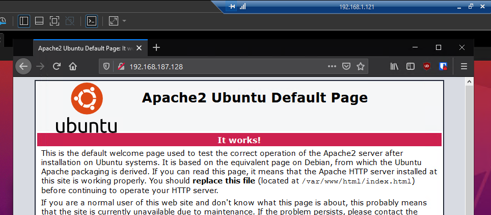

Opretter egne sites.

```
sudo mkdir -p /var/www/html/biblioteket1.opgave/public_html
sudo mkdir -p /var/www/html/biblioteket2.opgave/public_html

cd /var/www/html/biblioteket1.opgave/public_html
sudo nano index.html

cd /var/www/html/biblioteket2.opgave/public_html
sudo nano index.html
```
Opretter to index.html filer for de nye websites.
```
<html>
 <head>
 <title>biblioteket1.opgave</title>
 </head>
 <body>
 <h1>Hej, dette er en test-side for biblioteket1's hjemmeside.</h1>
 </body>
</html>

&

<html>
 <head>
 <title>biblioteket2.opgave</title>
 </head>
 <body>
 <h1>Hej, dette er en test-side for biblioteket2's hjemmeside.</h1>
 </body>
</html>
```

### :small_blue_diamond: Ubunto Firewall (UFW)
Giver adgang for HTTPS-trafik, og tillader profilen "Apache fuld". Derefter slettes den overflødige "Apache" -profil
```
sudo ufw allow 'Apache Full'
sudo ufw delete allow 'Apache'
```
Starter UFW op.
```
sudo ufw enable
```
UFW Status.
```
sudo ufw status
```
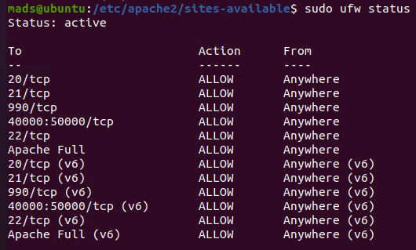

## :large_blue_diamond: VirtualHost
```
cd /etc/apache2/sites-available/
```
Tager en kopi af 000-default.conf og gemmer den som biblioteket1.opgave.conf og biblioteket2.opgave.conf
```
sudo cp 000-default.conf biblioteket1.opgave.conf
sudo cp 000-default.conf biblioteket2.opgave.conf
```

Åbner biblioteket1.opgave.conf + biblioteket2.opgave.conf
```
sudo nano biblioteket1.opgave.conf
sudo nano biblioteket2.opgave.conf
```
Retter/tilføjer følgende linjer i de to .conf-filer.
```
ServerAdmin	webmaster@localhost
ServerName	biblioteket1.opgave
ServerAlias	www.biblioteket1.opgave
DocumentRoot	/var/www/html/biblioteket1.opgave/public_html
```
Luk og gem.

Aktiver de to nye sites.
```
sudo a2ensite biblioteket1.opgave.conf
sudo a2ensite biblioteket2.opgave.conf
```
Deaktiver den gamle standard site.
```
sudo a2dissite 000-default.conf
```

Mit nye website kan nu findes på biblioteket1.opgave og biblioteket2.opgave.
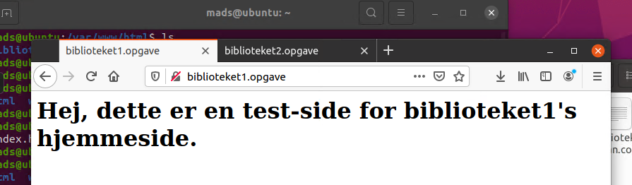

### :small_blue_diamond: Hosts
```
sudo nano /etc/hosts
```
Indsætter IP og VirtualHost-navne.
```
192.168.187.128 biblioteket1.opgave
192.168.187.128 biblioteket2.opgave
192.168.187.128 wordpress
192.168.187.128 privateparts
```

## :large_blue_diamond: HTTPS
Starter med at lave backup af den originale fil.
```
sudo cp /etc/apache2/sites-available/default-ssl.conf /etc/apache2/sites-available/default-ssl.conf.bak
```
```
sudo nano /etc/apache2/sites-available/default-ssl.conf
```
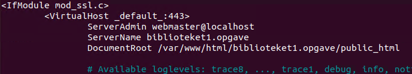
Aktivering af ændringer i Apache
```
sudo a2enmod ssl
sudo a2enmod headers
```
```
sudo a2ensite default-ssl
```
```
sudo systemctl restart apache2
```
```
sudo apache2ctl configtest

Syntax OK
```

### :small_blue_diamond: Redirect
```
sudo nano /etc/apache2/sites-available/biblioteket1.opgave.conf
```
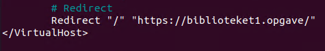

## :large_blue_diamond: FTP


## :large_blue_diamond: SSH
Henter og installerer OpenSSH.
```
sudo apt install openssh-server
```
Kontroller status.
```
sudo systemctl status ssh
```
Åbner porte i UFW.
```
sudo ufw allow ssh
```
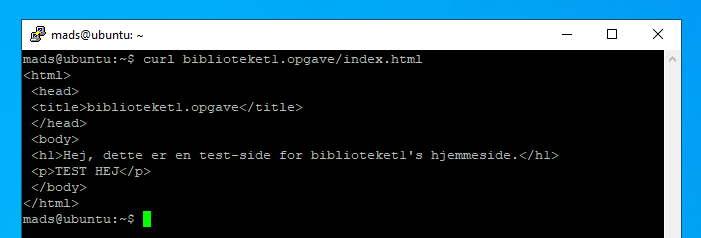

## :large_blue_diamond: .htpasswd
Starter med at oprette .htpasswd og tilføje brugere.
Første gang vi bruger dette værktøj, skal vi tilføje -c indstillingen for at oprette den angivne fil.
```
sudo htpasswd -c /etc/apache2/.htpasswd mads
```
Man vil efterfølgende blive spurgt om at angive et password. Næste bruger opretter vi uden -c indstillingen.
```
sudo htpasswd /etc/apache2/.htpasswd anden_bruger
```
Se indholdet af .htpasswd filen.
```
cat /etc/apache2/.htpasswd
```
Resultat:
```
mads:$apr1$ipsuwA6.$t2qJzRkIpCGljYLXenUEC.
anden_bruger:$apr1$cqokJ/IC$XFEXtS/xbwbZNl/oAlPtO1
```

Konfiguration af adgangskontrol inden for den virtuelle værtsdefinition.
```
sudo nano /etc/apache2/sites-enabled/privateparts.conf
```
```
<VirtualHost *:80>
	....

	<Directory "/var/www/html/privateparts/public_html">
		AuthType Basic
		AuthName "Restricted Content"
		AuthUserFile /etc/apache2/.htpasswd
		Require valid-user
	</Directory>
</VirtualHost>
```
```
sudo service apache2 restart
```
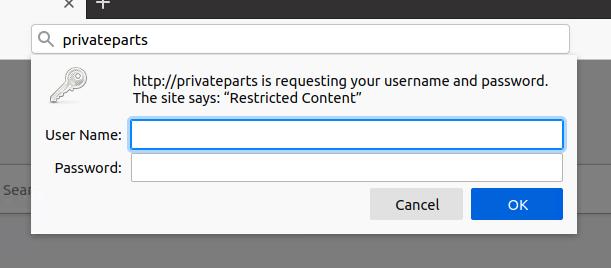

## :large_blue_diamond: MySQL
Henter og installerer MySQL.
```
sudo apt install mysql-server
```
 Start MySQL.
 ```
 sudo mysql
 ```
 Exit MySQL console.
 ```
 exit
 ```

## :large_blue_diamond: CGI


## :large_blue_diamond: PHP
```
sudo apt install php libapache2-mod-php php-mysql
```
Se hvilken PHP version der er installeret.
```
php -v
```
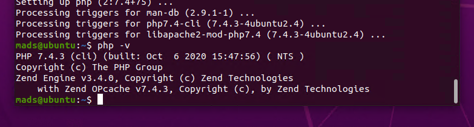

Test om PHP virker, opret en ny fil der hedder info.php
```
sudo nano /var/www/html/biblioteket2.opgave/public_html/info.php
```
Indsæt følgende i info.php og gem den.
```
<?php
phpinfo();
?>
```
Gå til dit website igen.
```
biblioteket2.opgave/info.php
```
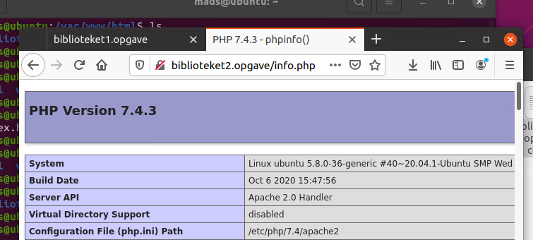

## :large_blue_diamond: Wordpress
Starter med at logge ind i MySQL.
```
mysql -u root -p
```
Opretter database kun til Wordpress brug.
```
CREATE DATABASE wordpress DEFAULT CHARACTER SET utf8 COLLATE utf8_unicode_ci;
```

Opretter brugeren "wordpressuser" med tilhørende kodeord "password".
```
CREATE USER 'wordpressuser'@'%' IDENTIFIED WITH mysql_native_password BY 'password';
```

Giver den nyoprettede bruger adgang til databasen wordpress.
```
GRANT ALL ON wordpress.* TO 'wordpressuser'@'%';
```

Til sidst.
```
FLUSH PRIVILEGES;
og
EXIT;
```

Henter og installere PHP Extensions.
```
sudo apt install php-curl php-gd php-mbstring php-xml php-xmlrpc php-soap php-intl php-zip
```
Genstart Apache.
```
sudo systemctl restart apache2
```

Opdatere Apache's .htaccess konfigurationer.
```
sudo nano /etc/apache2/sites-available/wordpress.conf
```
Indsæt følgende i VirtualHost blokken.
```
<Directory /var/www/wordpress/>
    AllowOverride All
</Directory>
```

Aktiver Rewrite Module.
```
sudo a2enmod rewrite
```
Ovenstående gør det muligt at lave permalinks der er nemmere at læse for mennesker.
```
http://example.com/2012/post-name/
http://example.com/2012/12/30/post-name
```
Check for syntax fejl inden vi går videre.
```
sudo apache2ctl configtest
```
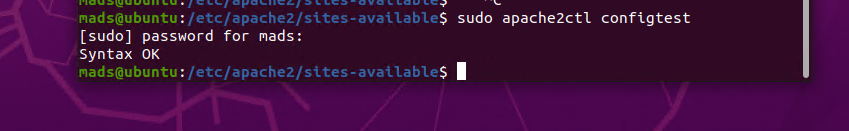

Genstart Apache endnu en gang.
```
sudo systemctl restart apache2
```

### :small_blue_diamond: Download
```
cd /tmp
curl -O https://wordpress.org/latest.tar.gz
```
Pak filen ud.
```
tar xzvf latest.tar.gz
```
Opret dummy .htaccess fil som Wordpress kan bruge senere.
```
touch /tmp/wordpress/.htaccess
```
Lav en kopi af wp-config-sample.php Wordpress rent faktisk kan læse.
```
cp /tmp/wordpress/wp-config-sample.php /tmp/wordpress/wp-config.php
```
Opretter "upgrade" mappe til Wordpress for fremtide opgraderinger.
```
mkdir /tmp/wordpress/wp-content/upgrade
```
Kopier hele mappen wordpress over til vores mappe på server delen. "." betyder den også tager f.eks. .htaccess filer med.
```
sudo cp -a /tmp/wordpress/. /var/www/wordpress
```

### :small_blue_diamond: Konfiguration
Giver Apache read og write til Wordpress filerne.
```
sudo chown -R www-data:www-data /var/www/wordpress
```
Sætter rettigheder på mapper og filer.
```
sudo find /var/www/wordpress/ -type d -exec chmod 750 {} \;
sudo find /var/www/wordpress/ -type f -exec chmod 640 {} \;
```

Konfiguration af WordPress Configuration File.

For at hente sikre værdier fra WordPress-hemmelige nøglegenerator, skriv:
```
curl -s https://api.wordpress.org/secret-key/1.1/salt/
```
!NEDESTÅENDE ER KUN FOR SHOW - BRUG IKKE DENNE KEY!
```
define('AUTH_KEY',         '1jl/vqfs<XhdXoAPz9 DO NOT COPY THESE VALUES c_j{iwqD^<+c9.k<J@4H');
define('SECURE_AUTH_KEY',  'E2N-h2]Dcvp+aS/p7X DO NOT COPY THESE VALUES {Ka(f;rv?Pxf})CgLi-3');
define('LOGGED_IN_KEY',    'W(50,{W^,OPB%PB<JF DO NOT COPY THESE VALUES 2;y&,2m%3]R6DUth[;88');
define('NONCE_KEY',        'll,4UC)7ua+8<!4VM+ DO NOT COPY THESE VALUES #`DXF+[$atzM7 o^-C7g');
define('AUTH_SALT',        'koMrurzOA+|L_lG}kf DO NOT COPY THESE VALUES  07VC*Lj*lD&?3w!BT#-');
define('SECURE_AUTH_SALT', 'p32*p,]z%LZ+pAu:VY DO NOT COPY THESE VALUES C-?y+K0DK_+F|0h{!_xY');
define('LOGGED_IN_SALT',   'i^/G2W7!-1H2OQ+t$3 DO NOT COPY THESE VALUES t6**bRVFSD[Hi])-qS`|');
define('NONCE_SALT',       'Q6]U:K?j4L%Z]}h^q7 DO NOT COPY THESE VALUES 1% ^qUswWgn+6&xqHN&%');
```

Åbner WordPress configuration filen og sætter den ny generede key ind.
```
sudo nano /var/www/wordpress/wp-config.php
```
I den samme fil sættes de sidste ting op.
```
// ** MySQL settings - You can get this info from your web host ** //
/** The name of the database for WordPress */
define( 'DB_NAME', 'wordpress' );

/** MySQL database username */
define( 'DB_USER', 'wordpressuser' );

/** MySQL database password */
define( 'DB_PASSWORD', 'password' );
```
Gem og luk.

Åben en browser og skriv "wordpress/" i adresse-feltet og start web-installationen.
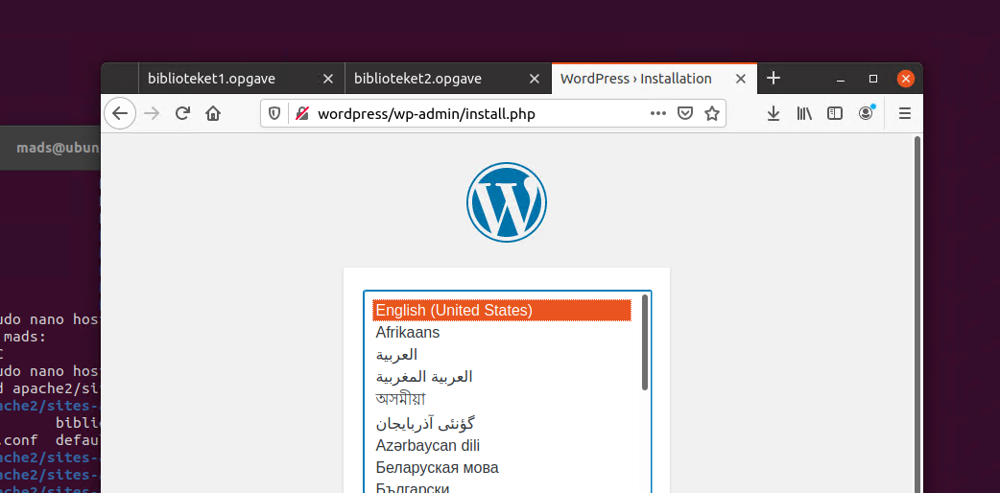


[Go To TOP](#spider_web-web-server-hf2)
