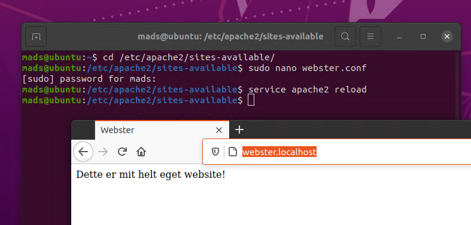
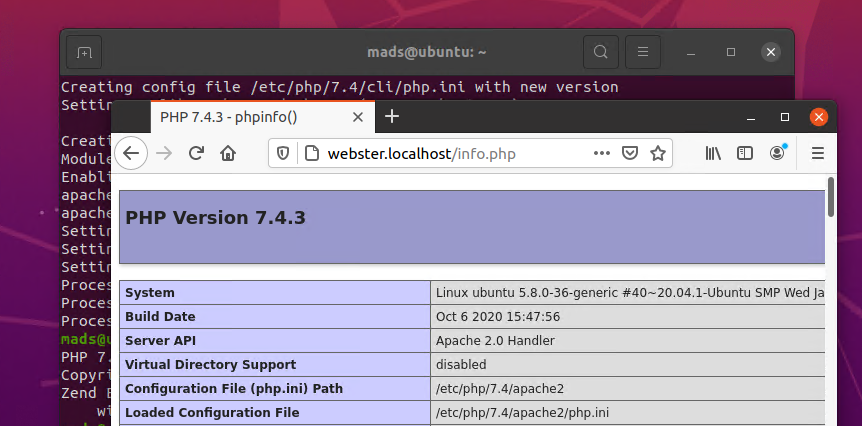

# :spider_web: Web-server-HF2

Først downloader og installere jeg Ubuntu Desktop. Desktop er bare lidt nemmere i denne sammenhæng. Skulle web-serveren bruges i den virkelige verden var valget faldet på Ubuntu Server, men i denne sammenhæng gør det ingen forskel.

### :computer: Lad os starte med at installere Apache2:
 
 ```
sudo apt update
sudo apt install apache2
```


Opretter min egen side istedet for standard siden.

```
sudo mkdir /var/www/webster/

cd /var/www/webster/
sudo nano index.html

<html>
<head>
  <title>Webster</title>
</head>
<body>
  <p>Dette er mit helt eget website!</p>
</body>
</html>
```

Sætter VirtualHost op så man kan se mit nye website.

```
cd /etc/apache2/sites-available/
```

Tager en kopi af 000-default.conf og gemmer den som webster.conf
```
sudo cp 000-default.conf webster.conf
```

Åbner webster.conf
```
sudo nano webster.conf
```
Retter følgende linjer.
```
DocumentRoot /var/www/webster/
ServerName webster.localhost
```
Luk og gem.

Hvis siden ikke er _enabled_ kan du gøre det med følgende kommando.
```
sudo a2ensite gci.conf
```

Mit nye website kan nu findes på webster.local.


Tillader trafik på port 80.
```
sudo ufw allow in "Apache"
```

Starter UFW op.
```
sudo ufw enable
```
UFW Status.
```
sudo ufw status
```

### :computer: Installer MySQL-server.
```
sudo apt install mysql-server
```
 Start MySQL.
 ```
 sudo mysql
 ```
 Exit MySQL console.
 ```
 exit
 ```

### :computer: Installer PHP.
```
sudo apt install php libapache2-mod-php php-mysql
```
Se hvilken PHP version der er installeret.
```
php -v
```


Test om PHP virker, opret en ny fil der hedder info.php
```
nano /var/www/webster/info.php
```
Gå til dit website igen.
```
webster.localhost/info.php
```

